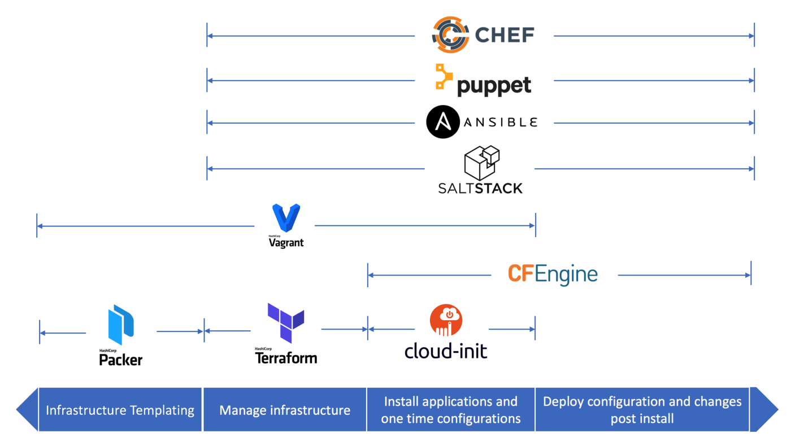

What is Infrastructure as Code?
==================================

What is Infrastructure?
---------------------------

Infrastructure通常指的是application运行所依赖的底层的 ``基础设施`` 和它们的 ``配置``. 这里的基础设施通常是指物理层之上的部分，并不是一个物理设备，一块硬盘，而是一个虚拟机，一个操作系统，一个软件防火墙，网络配置，负载均衡等等。

Infrastructure as Code (IaC)
-------------------------------

简单来说，IaC就是通过代码的方式去管理Infrastructure，它的创建，配置等等。

IaC可以解决软件部署时，运行环境的一致性问题。通过同一套代码就可以创建出一套完全相同的环境，而这样一套环境在IaC产生之前，需要通过人工在Web GUI上去创建和管理。

Infrastructure as code (IaC) tools allow you to manage infrastructure with configuration files rather than through a graphical user interface. IaC allows you to build, change, and manage your infrastructure in a safe,
consistent, and repeatable way by defining resource configurations that you can version, reuse, and share.

The idea is to treat your Infrastructure like software. You need to write the code, test it, and execute it to set up, deploy, update, or delete the required Infrastructure.

IaC是实现DevOps的关键基础之一。

Which are the Best IaC Tools in 2022?
-------------------------------------------

https://medium.com/cloudnativeinfra/when-to-use-which-infrastructure-as-code-tool-665af289fbde

- Terraform
- Ansible
- Cloud init
- Chef
- Puppet
- SaltStack
- Vagrant

Declarative vs. Imperative
------------------------------

可以参考 Declarative and Imperative programming

Declarative - Tell what "not" how
Imperative - Tell what "and" how