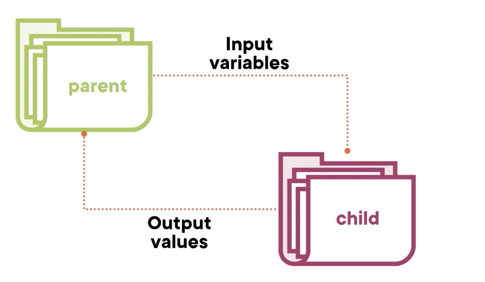

Module
==========

What is a module?
-------------------

Module可以理解成Python里的library或者模块，主要是为了代码重用和防止重新造轮子。

Module可以是本地的，也可以是远程的。

- 远程module可以在https://registry.terraform.io/browse/modules 查看下载
- 远程module会在引用时，通过terraform init下载到本地。
- 远程module需要指定版本

Structure
-----------

和“函数”类似，输入->函数体->输出。

- input
- resources
- output

发布一个Module
-----------------

https://www.terraform.io/registry/modules/publish

module的文件结构如下： 

参考 https://www.terraform.io/language/modules/develop/structure

- 在github上创建一个repo
- 在repo里创建一个main.tf
- 在repo里创建一个variables.tf
- 在repo里创建一个outputs.tf
- 在repo里创建一个README.md
- 在repo里创建一个LICENSE
- 在repo里创建一个.gitignore

一个例子
---------

GitHub仓库 https://github.com/xiaopeng163/terraform-aws-vpc

Terraform Registry https://registry.terraform.io/modules/xiaopeng163/vpc/aws/latest
