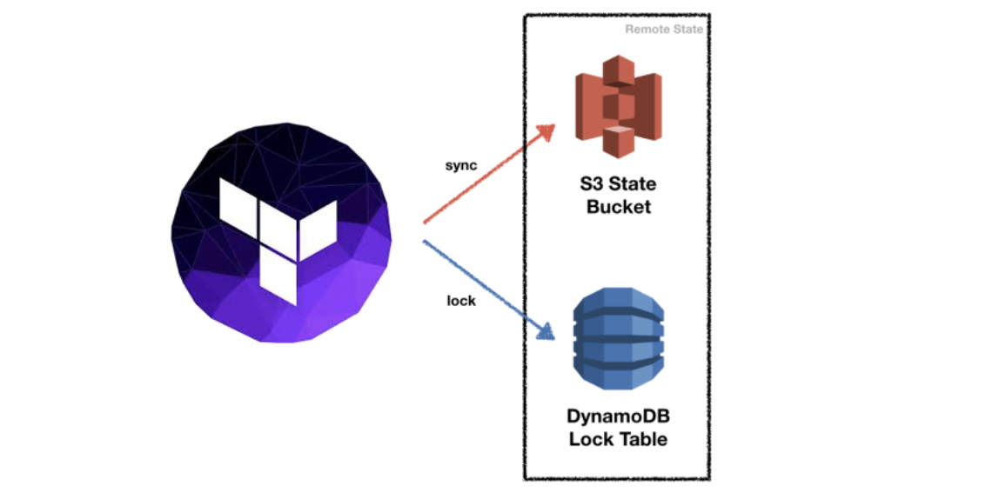

Managing State
==================

https://www.terraform.io/language/state

state is a file that contains a serialized representation of your infrastructure and configuration.

Backends determine where state is stored. For example, the local (default) backend stores state in a local JSON file on disk.

1. local state

默认情况下，Terraform会将状态保存在一个文件中，这个文件的名称是 ``terraform.tfstate``。

local state的文件和存储位置是可以修改的

.. code-block:: terraform

   terraform {
      backend "local" {
         path = "relative/path/to/terraform.tfstate"
      }
   }

2. remote state

Terraform writes the state data to a remote data store, which can then be shared between all members of a team.
Terraform supports storing state in:

- Terraform Cloud
- HashiCorp Consul
- Amazon S3
- Azure Blob Storage
- Google Cloud Storage
- Alibaba Cloud OSS
- and more

3. lock

.. toctree::
   :maxdepth: 2
   :caption: Contents:

   state/command
   state/s3
   state/consul
   state/taint
   state/import

常用命令
------------

.. code-block:: bash

   terraform state help
   Usage: terraform [global options] state <subcommand> [options] [args]

   This command has subcommands for advanced state management.

   These subcommands can be used to slice and dice the Terraform state.
   This is sometimes necessary in advanced cases. For your safety, all
   state management commands that modify the state create a timestamped
   backup of the state prior to making modifications.

   The structure and output of the commands is specifically tailored to work
   well with the common Unix utilities such as grep, awk, etc. We recommend
   using those tools to perform more advanced state tasks.

   Subcommands:
      list                List resources in the state
      mv                  Move an item in the state
      pull                Pull current state and output to stdout
      push                Update remote state from a local state file
      replace-provider    Replace provider in the state
      rm                  Remove instances from the state
      show                Show a resource in the state

.. code-block:: bash

   $ terraform refresh -help
   Usage: terraform [global options] refresh [options]

   Update the state file of your infrastructure with metadata that matches
   the physical resources they are tracking.

   This will not modify your infrastructure, but it can modify your
   state file to update metadata. This metadata might cause new changes
   to occur when you generate a plan or call apply next.

.. code-block:: bash

   $ terraform force-unlock --help
   Usage: terraform [global options] force-unlock LOCK_ID

     Manually unlock the state for the defined configuration.

     This will not modify your infrastructure. This command removes the lock on the
     state for the current workspace. The behavior of this lock is dependent
     on the backend being used. Local state files cannot be unlocked by another
     process.

   Options:

     -force                 Don't ask for input for unlock confirmation.

.. code-block:: bash

   $ terraform show --help
   Usage: terraform [global options] show [options] [path]

     Reads and outputs a Terraform state or plan file in a human-readable
     form. If no path is specified, the current state will be shown.

   Options:

     -no-color           If specified, output won't contain any color.
     -json               If specified, output the Terraform plan or state in
                         a machine-readable form.