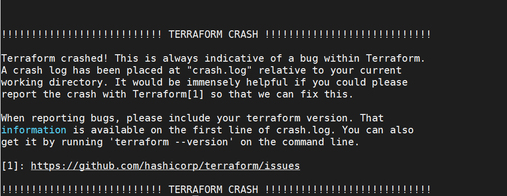

Troubleshooting
====================

- Validating Configurations
- Enable verbose logging
- Resource taints
- Crash logs

Types of Errors
------------------

- Command Errors
- Syntax validation
- Provider validation
- Deployment errors

Command Errors
~~~~~~~~~~~~~~~~~~

.. code-block:: bash

    $ terraform plan -auto
    ╷
    │ Error: Failed to parse command-line flags
    │
    │ flag provided but not defined: -auto
    ╵

    For more help on using this command, run:
      terraform plan -help

Synctax Validation
~~~~~~~~~~~~~~~~~~

- Terraform init first
- check syntax and logic
- does not check state
- manual or automatic
- automation checks in pipelines

一般发生在 ``terraform init`` 和 ``terraform validate`` 时

.. note::
    The Terraform configuration must be valid before initialization so that
    Terraform can determine which modules and providers need to be installed.

例如：

.. code-block:: bash

    $ terraform init
    There are some problems with the configuration, described below.

    The Terraform configuration must be valid before initialization so that
    Terraform can determine which modules and providers need to be installed.
    ╷
    │ Error: Argument or block definition required
    │
    │ On network.tf line 6: An argument or block definition is required here. To set an argument, use the equals sign "=" to introduce the argument value.

Provider Validation and Deployment Errors
~~~~~~~~~~~~~~~~~~

一般发生在plan和apply时

.. code-block:: bash

    $ terraform plan
    ╷
    │ Error: Unsupported attribute
    │
    │   on network.tf line 10, in resource "aws_subnet" "my_subnet":
    │   10:   vpc_id     = aws_vpc.my_vpc.ids
    │
    │ This object has no argument, nested block, or exported attribute named "ids". Did you mean "id"?

Deployment errors

比如一些只有deploy时才会发现的错误。例如，S3 bucket name must be unique across all existing bucket names in Amazon S3.

Verbose Logging
--------------------

https://www.terraform.io/internals/debugging

- ``TF_LOG=TRACE``
- ``TF_LOG_PATH``

You can set ``TF_LOG`` to one of the log levels (in order of decreasing verbosity) ``TRACE``, ``DEBUG``, ``INFO``, ``WARN`` or ``ERROR`` to change the verbosity of the logs.

.. code-block:: bash

    $ export TF_LOG=DEBUG
    $ terraform plan
    2022-09-06T19:47:22.678Z [INFO]  Terraform version: 1.2.8
    2022-09-06T19:47:22.678Z [DEBUG] using github.com/hashicorp/go-tfe v1.0.0
    2022-09-06T19:47:22.678Z [DEBUG] using github.com/hashicorp/hcl/v2 v2.12.0
    2022-09-06T19:47:22.678Z [DEBUG] using github.com/hashicorp/terraform-config-inspect v0.0.0-20210209133302-4fd17a0faac2
    2022-09-06T19:47:22.678Z [DEBUG] using github.com/hashicorp/terraform-svchost v0.0.0-20200729002733-f050f53b9734
    2022-09-06T19:47:22.678Z [DEBUG] using github.com/zclconf/go-cty v1.11.0
    2022-09-06T19:47:22.678Z [INFO]  Go runtime version: go1.18.1
    2022-09-06T19:47:22.678Z [INFO]  CLI args: []string{"/usr/local/bin/terraform_1.2.8", "plan"}
    ...
    ...
    ...

关闭logging

.. code-block:: bash

    $ export TF_LOG=
    $ terraform plan
    ...

terraform taints
--------------------

https://www.terraform.io/docs/cli/commands/taint.html

crash log
--------------------

open issue on GitHub

