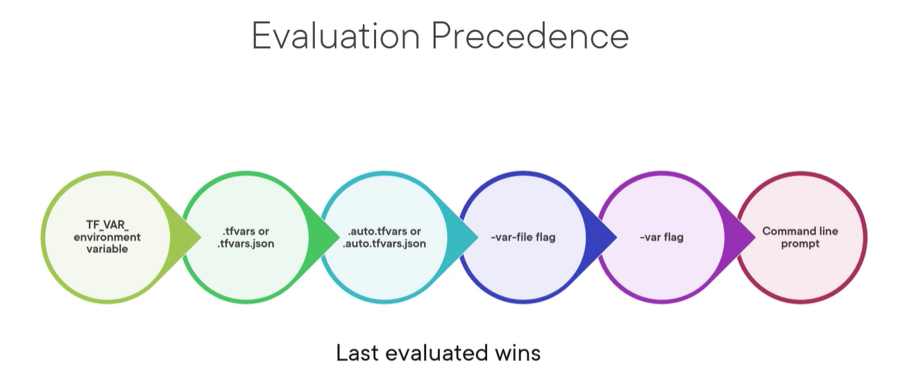

Variables
=================

https://www.terraform.io/language/values/variables

Variable Syntax
--------------------

.. code-block:: terraform

    variable "name_label" {

      type = string

      description = "value"

      default = "value"

      sensitive = true

    }

to reference the variable ``var.<name_label>``

.. note::

   我们可以使用 ``terraform console`` 去测试variable. https://www.terraform.io/cli/commands/console

Data Types
----------------

https://www.terraform.io/language/expressions/types

Primitive Types
~~~~~~~~~~~~~~~~~~~

- String
- number
- boolean

.. code-block:: terraform

  variable "aws_secret_key" {
    type        = string
    description = "aws secret key"
    sensitive   = true
  }

  variable "enable_dns_hostnames" {
    type        = bool
    description = "enable dns hostname"
    default     = true
  }

  variable "volume_size" {
    type        = number
    description = "volume size in gibibytes"
    default     = 10
  }

to reference the values in terraform code, just ``var.<name_label>`` , like ``var.aws_secret_key``

.. code-block:: bash

  > var.aws_secret_key
  (sensitive)
  > var.enable_dns_hostnames
  true
  > var.volume_size
  10

Collections Types
~~~~~~~~~~~~~~~~~~~~

- List (list里的所有数据的数据类型必须是一样的，比如 ``list(string)``, ``list(number)`` )

.. code-block:: terraform

    variable "aws_regions" {

      type = list(string)

      description = "Region to use for AWS"

      default = ["us-east-1", "us-east-2", "us-west-1", "us-west-2"]

    }

to reference collection values:

``var.<name_labe>[<index>]``  index will start 0.

.. code-block:: bash

  > var.aws_regions
  tolist([
    "eu-central-1",
    "us-east-1",
    "us-east-2",
  ])
  > var.aws_regions[1]
  "us-east-1"
  > var.aws_regions[0]
  "eu-central-1"

- map , a group of values identified by named labels, 数据类型需要一致.

.. code-block:: terraform

    variable "aws_instance_sizes" {

      type        = map(string)
      description = "instance sizes"
      default = {

        small  = "t2.micro"
        medium = "t2.small"
        large  = "t2.large"
      }
    }

to reference ``var.<name_label>.<key_name>`` or ``var.<name_label>["key_name"]``

.. code-block:: bash

  > var.aws_instance_sizes
  tomap({
    "large" = "t2.large"
    "medium" = "t2.small"
    "small" = "t2.micro"
  })
  >

  > var.aws_instance_sizes.large
  "t2.large"
  > var.aws_instance_sizes["large"]
  "t2.large"
  >

类型不一致会进行类型转换

.. code-block:: terraform

  variable "student1" {
    type        = map(string)
    description = "student information"
    default = {
      name = "xxxx"
      age  = 20
    }
  }

.. code-block:: bash

  > var.student1
  tomap({
    "age" = "20"
    "name" = "xxxx"
  })
  > var.student1.age
  "20"

Structural Types
~~~~~~~~~~~~~~~~~~~~

- Tuple，对应List，不同之处是Tuple里的数据元素可以是不同的数据类型

.. code-block:: terraform

    variable "tuple_test" {

      type = tuple

      description = "tuple test"

      default = ["a", 15, true]

    }

.. code-block:: bash

  $ terraform console
  >

  > var.tuple_test
  [
    "a",
    15,
    true,
  ]
  > var.tuple_test[0]
  "a"
  > var.tuple_test[1]
  15
  > var.tuple_test[2]
  true
  >

- object，对应Map，但是数值的类型可以不同

.. code-block:: terraform

  variable "db_port" {
    type = object({
      external = number
      internal = number
      protocol = string
    })

    default = {
      external = 5432
      internal = 5433
      protocol = "tcp"
    }

  }

.. code-block:: bash

  $ terraform console
  >

  > var.db_port
  {
    "external" = 5432
    "internal" = 5433
    "protocol" = "tcp"
  }
  > var.db_port.external
  5432
  > var.db_port["internal"]
  5433
  >

Supply variable values
------------------------------

- default value
- -var flag
- -var-file flag
- tf var files

    - terraform.tfvars
    - terraform.tfvars.json
    - .auto.tfvars
    - .auto.tfvars.json

- Environment variable name starts with ``TF_VAR_``

Demo
------

.. code-block:: terraform

    terraform {
      required_providers {
        aws = {
          source  = "hashicorp/aws"
          version = "~> 4.16"
        }
      }

      required_version = ">= 1.2.0"
    }

    variable "aws_region" {
      type    = string
      default = "eu-central-1"
    }

    variable "aws_access_key" {

      type        = string
      description = "aws access key"
      sensitive   = true
    }

    variable "aws_secret_key" {

      type        = string
      description = "aws secret key"
      sensitive   = true
    }

    variable "enable_dns_hostnames" {

      type        = bool
      description = "enable dns hostname"
      default     = true
    }

    provider "aws" {
      access_key = var.aws_access_key
      secret_key = var.aws_secret_key
      region     = var.aws_region
    }

    resource "aws_vpc" "vpc" {
      cidr_block           = "10.0.0.0/16"
      enable_dns_hostnames = var.enable_dns_hostnames
      tags = {
        Name = "my-vpc-demo"
      }
    }

use -var
~~~~~~~~~~~~

.. code-block:: bash

    terraform plan -var=aws_access_key="xxxxxxxxx" -var=aws_secret_key="xxxxxxxx"

use Environment vars
~~~~~~~~~~~~~~~~~~~~~~~

for Linux and Mac

.. code-block:: bash

    export TF_VAR_aws_access_key=xxxxxxxxxxxxxxxx
    export TF_VAR_aws_secret_key=xxxxxxxxxxxxxxxx

for windows powershell

.. code-block:: powershell

    $env:TF_VAR_aws_access_key="xxxxxxxxxxxxxxxx"
    $env:TF_VAR_aws_secret_key="xxxxxxxxxxxxxxxx"

use tfvars files
~~~~~~~~~~~~~~~~~~

create a file ``terraform.tfvars``

.. code-block:: terraform

    aws_access_key="xxxxxxxxxxxxxxxx"
    aws_secret_key="xxxxxxxxxxxxxxxx"
