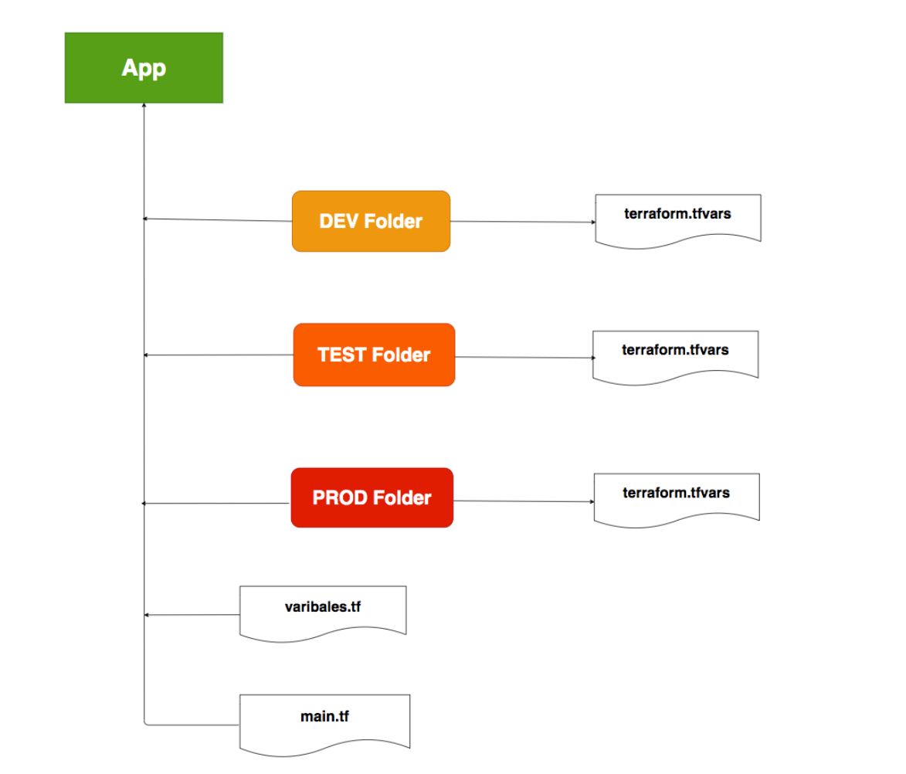

Collaboration
==================

如何在terraform中多人协作， 有下面的几个基本问题需要解决：

- 如何共享state文件 （remote state)
- 如何共享变量

  - 普通变量
  - 密码变量

- 如何管理多环境（dev, test, prod）

  - 不同环境的state
  - 不同环境的变量

多文件/文件夹的形式
----------------------

然后在执行的时候，指定不同的变量文件和state文件

.. code-block:: bash

    // Dev Environment
    terraform apply -var-file=common.tfvars -var-file=dev/terraform.tfvars -state=dev/terraform.tfstate
    // QA Environment
    terraform apply -var-file=common.tfvars -var-file=qa/terraform.tfvars -state=qa/terraform.tfstate
    // Prod Environment
    terraform apply -var-file=common.tfvars -var-file=prod/terraform.tfvars -state=prod/terraform.tfstate

Workspace
-----------------

.. list-table:: Multi Environment
   :header-rows: 1

   * - Variables
     - dev
     - qa
     - prod
   * - cidr_block
     - 10.0.0.0/16
     - 10.1.0.0/16
     - 10.2.0.0/16
   * - subnet_count
     - 1
     - 1
     - 2

code example  ``code/multi-env-demo``

Create workspaces
~~~~~~~~~~~~~~~~~~~~~~~

默认workspace是default， 可以通过下面的命令创建新的workspace

.. code-block:: bash

    terraform workspace new dev
    terraform workspace new qa
    terraform workspace new prod

创建新的workspace后，会自动切换到新的workspace， 可以通过下面的命令查看当前的workspace

.. code-block:: bash

    terraform workspace show

查看当前所有的workspace

.. code-block:: bash

    terraform workspace list

切换到指定的workspace

.. code-block:: bash

    terraform workspace select dev

删除指定的workspace

.. code-block:: bash

    terraform workspace delete dev

workspace的使用
~~~~~~~~~~~~~~~~~~

可以在``tf文件``中使用``terraform.workspace``来获取当前的workspace， 从而区分不同的Workspace

.. code-block:: terraform

    locals {
        common_tags = {
            Environment = "${terraform.workspace}"
        }
    }